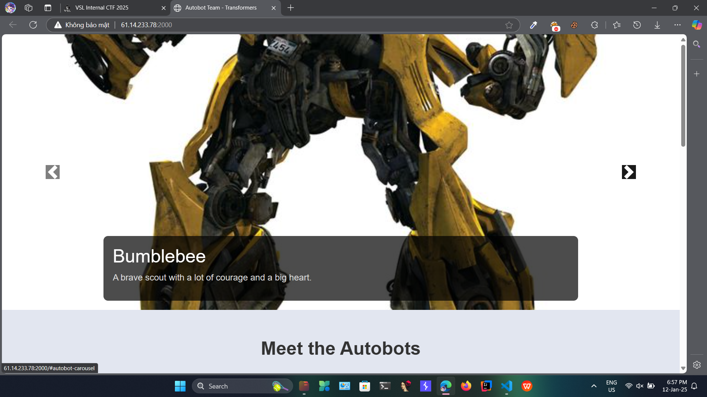
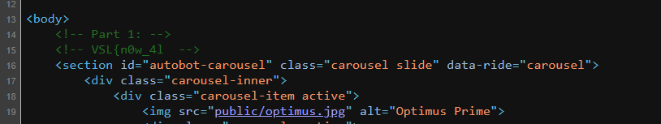
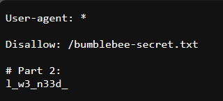
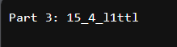
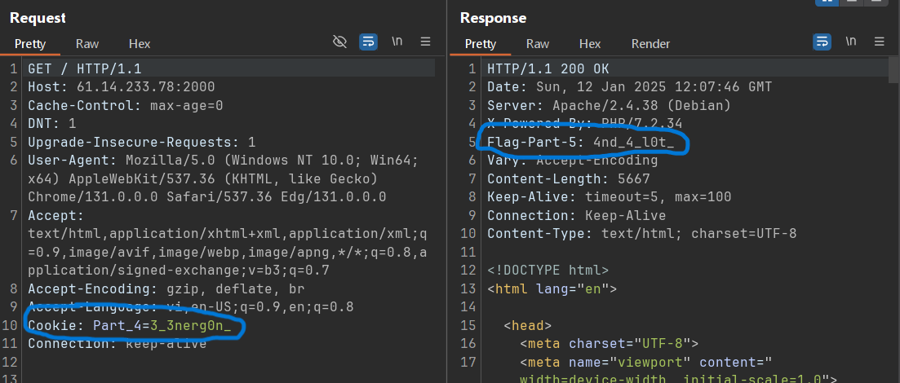
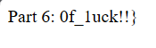

# Solution

- Giao diện chính của trang web



- Nhìn qua thì web chẳng có gì cả, mình sẽ bắt đầu từ việc kiểm tra source code của web

- Mở source code ra xem thì ta thấy được part 1 của flag



- Sau đó mình sử dụng `gobuster` để tìm các file và thư mục trên web

```bash
┌──(dangkhoaw㉿DangKhoa)-[~]
└─$ gobuster dir -t 50 -w /usr/share/wordlists/dirb/big.txt -u http://61.14.233.78:2000/
===============================================================
Gobuster v3.6
by OJ Reeves (@TheColonial) & Christian Mehlmauer (@firefart)
===============================================================
[+] Url:                     http://61.14.233.78:2000/
[+] Method:                  GET
[+] Threads:                 50
[+] Wordlist:                /usr/share/wordlists/dirb/big.txt
[+] Negative Status codes:   404
[+] User Agent:              gobuster/3.6
[+] Timeout:                 10s
===============================================================
Starting gobuster in directory enumeration mode
===============================================================
/.htpasswd            (Status: 403) [Size: 279]
/.htaccess            (Status: 403) [Size: 279]
/public               (Status: 301) [Size: 320] [--> http://61.14.233.78:2000/public/]
/robots.txt           (Status: 200) [Size: 81]
/server-status        (Status: 403) [Size: 279]
Progress: 20469 / 20470 (100.00%)
===============================================================
Finished
===============================================================
```

- Khi quét mình thấy có file `/robots.txt` truy cập được nên mình truy cập vào xem và thấy được part 2 của flag



- Truy cập vào file `/bumblebee-secret.txt` trong `/robots.txt` thì ta được part 3 của flag



- Bắt request thì thấy cookie có part 4 và response header có part 5 của flag



- Dùng `arjun` để tìm parameter của web

```bash
┌──(dangkhoaw㉿DangKhoa)-[~]
└─$ arjun -u http://61.14.233.78:2000/ -t 30
    _
   /_| _ '
  (  |/ /(//) v2.2.7
      _/

 Scanning 0/1: http://61.14.233.78:2000/
 Probing the target for stability
 Analysing HTTP response for anomalies
 Logicforcing the URL endpoint
 parameter detected: flag, based on: http headers
 Parameters found: flag
```

- Sau khi tìm được parameter `flag` nhập lên web thì ta được part 6 của flag

```
http://61.14.233.78:2000/?flag=1
```



# Flag

`VSL{n0w_4ll_w3_n33d_15_4_l1ttl3_3nerg0n_4nd_4_l0t_0f_1uck!!}`
