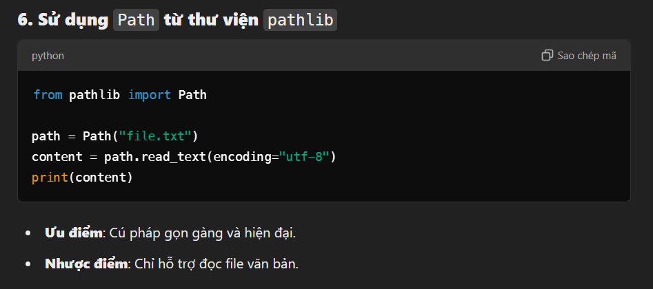

# Solution

- Giao diện chính của web


- Đọc file `Dockerfile` thì thấy thư mục làm việc là `/app` và có 1 file `flag.txt` trong thư mục `/app`

```Dockerfile
FROM python:3.9-slim
WORKDIR /app
COPY src/requirements.txt .
RUN pip install --no-cache-dir -r requirements.txt
COPY src/ .
RUN chmod 644 /app/app.py
RUN chmod -R 755 /app/templates
RUN chmod 444 /app/flag.txt
RUN adduser --disabled-password --gecos "" appuser
RUN chown -R appuser:appuser /app
USER appuser
ENV FLASK_ENV=production
ENV PYTHONUNBUFFERED=1
EXPOSE 1003
CMD ["python", "app.py"]
```

- Bây giờ sẽ tìm cách code python để đọc file `flag.txt`

- Đọc sơ qua source code (app.py) thì thấy bị cấm hàm các hàm này để tránh việc đọc file hoặc RCE


- Nhờ **ChatGPT** để hỏi gợi ý về cách đọc các file trong python mà không cần dùng hàm bị cấm ở trên



- **ChatGPT** gợi ý sử dụng module `pathlib` để đọc file và trong code thì module `pathlib` được cho phép (ở dòng 70 trong app.py)

- Vậy nên sẽ sử dụng module `pathlib` để đọc file `flag.txt`

```python
import pathlib

path = pathlib.Path("flag.txt")
content = path.read_text(encoding="utf-8")
print(content)
```

- Giải captcha và chạy code


# Flag

`VSL{all0w_3sc4p3_1s_fun_hehe_00e0dcbd5!}`
