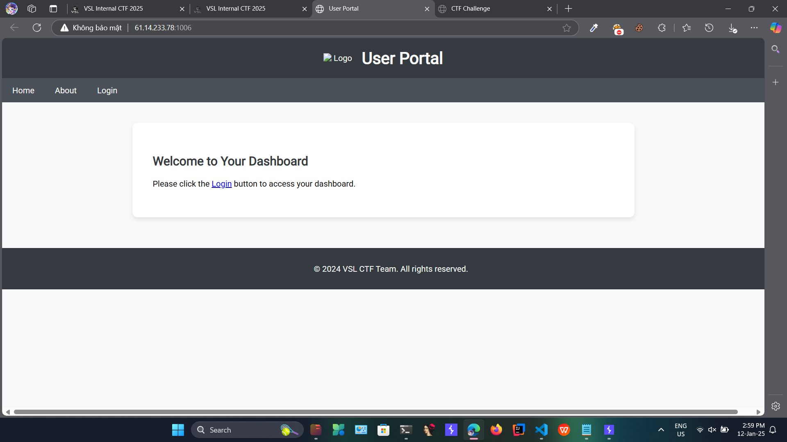
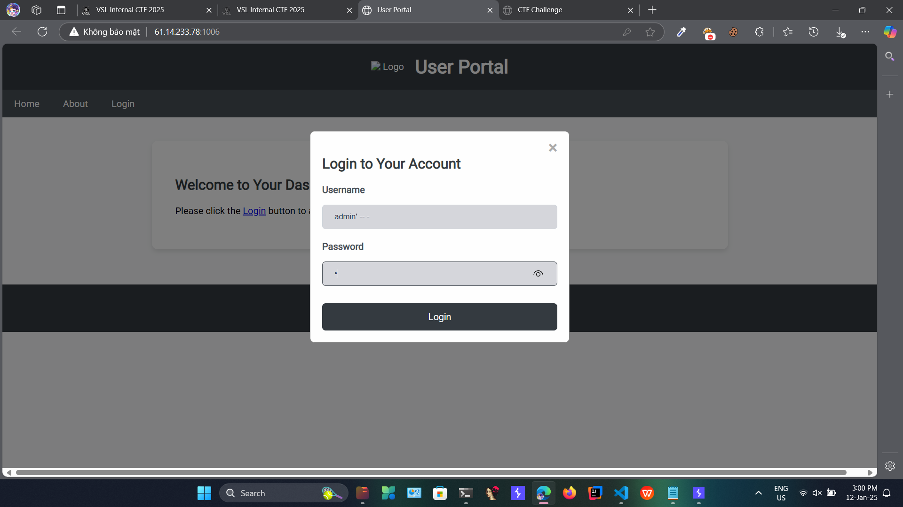
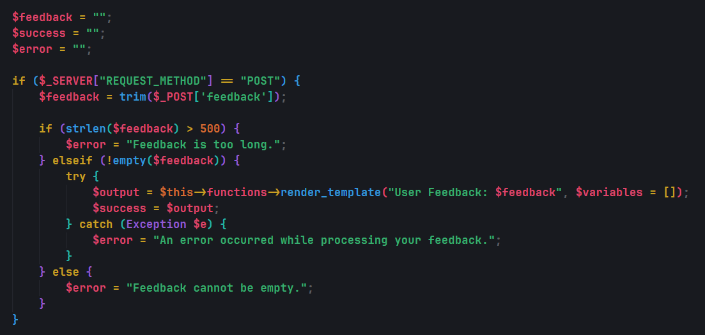
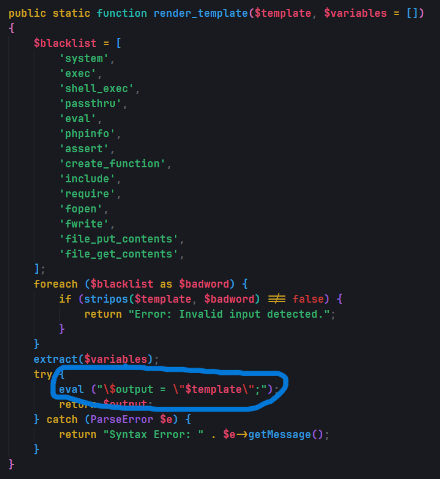
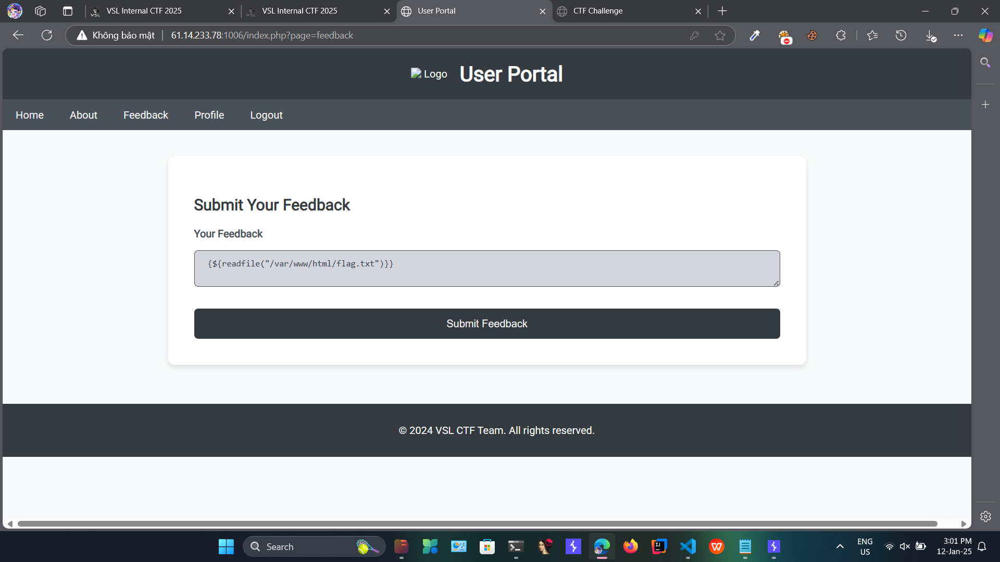
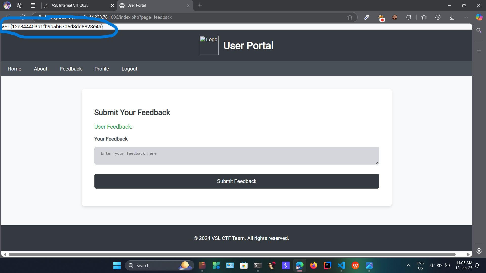

# Solution

- Giao diện chính của trang web



- Mới vào web thì chả có gì ngoài chức năng login. Đọc source code thì thấy bị lỗi `SQL Injection` (trong file AuthController.php)

```php
$sql = "SELECT * FROM users WHERE username = '$username' AND password = '$password'";
```

- Vì vậy dễ dàng vào acc admin



- Đọc file `Dockerfile` thì thấy flag.txt nằm ở thư mục `/var/www/html/flag.txt` nên mình sẽ tìm cách đọc file này

```Dockerfile
FROM php:7.2-apache
RUN docker-php-ext-install mysqli pdo pdo_mysql
WORKDIR /var/www/html/
COPY ./src /var/www/html/
COPY ./flag.txt /var/www/html/flag.txt
RUN echo "<Files \"flag.txt\">\n    Require all denied\n</Files>" > /var/www/html/.htaccess
RUN chown -R www-data:www-data /var/www/html \
    && chmod -R 750 /var/www/html \
    && chmod 640 /var/www/html/flag.txt
```

- Đọc source code thì thấy có 1 file `functions.php` có hàm eval (hàm này sẽ thực thi code php). Và trong file `FeedbackController.php` có dùng hàm `render_template` truyền vào 1 biến `$feedback` chỉ kiểm tra độ dài của biến này





- Và ở phương thức `render_template` được dùng ở file `FeedbackController.php` vì vậy t sẽ khai thác ở chức năng đăng feedback

- Payload:

```
{${readfile("/var/www/html/flag.txt")}}
```





# Flag

`VSL{12e844403b1fb9c5b6705d8dd8823e4a}`
