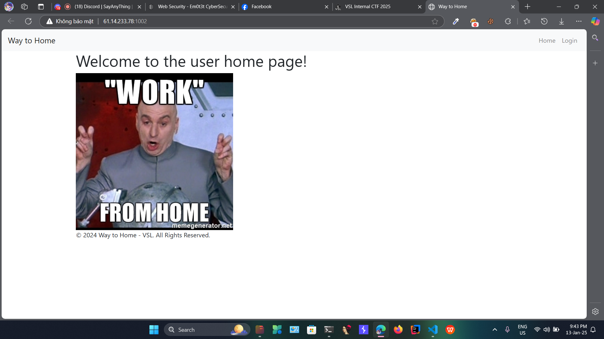
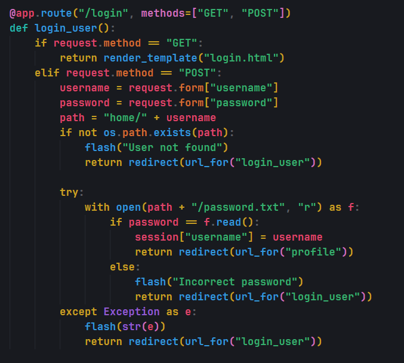
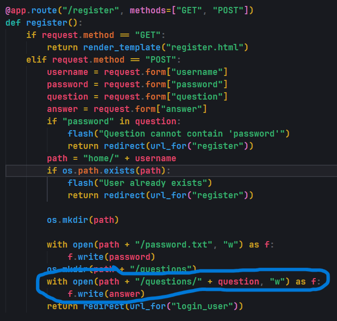
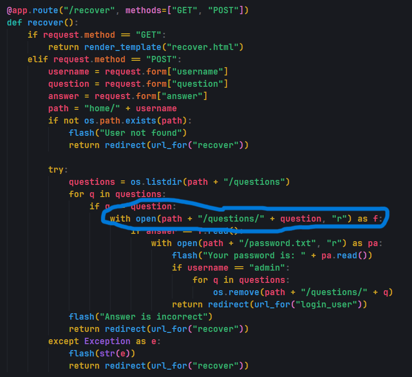
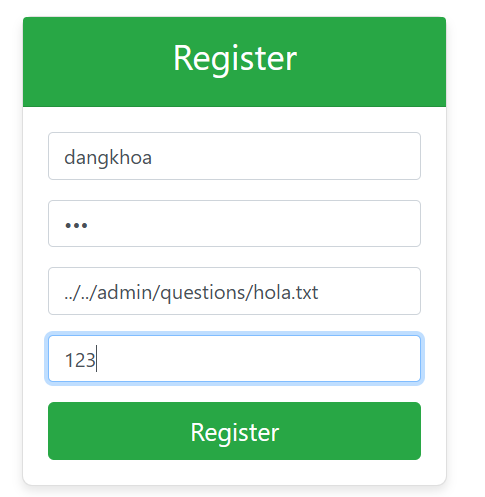
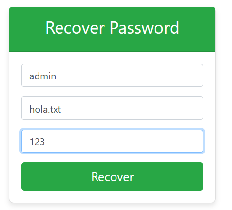
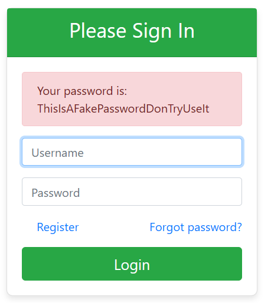
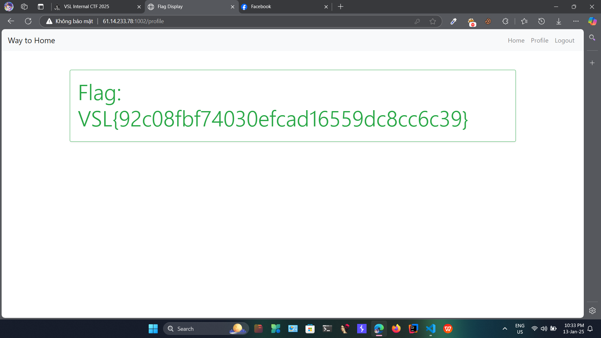

# Solution

- Giao diện chính của trang web. Nhìn qua thì chẳng có gì ngoài login cả

- Đọc sơ qua source ở `/login` thì thấy web sẽ đọc 1 file `password.txt` để kiểm tra password

- Tiếp tục đọc đến `/register` thì phát hiện bị lỗi `Path Traversal` (lỗi ở biến `question`)

- Tiếp tục đọc tiếp để có thêm thông tin. Ở `/recover` thì cũng bị lỗi `Path Traversal`

- Và từ đây ta sẽ tiến hành khai thác mật khẩu của **admin** bằng `Path Traversal` để lấy được flag bằng cách đăng nhập bằng tài khoản **admin**

- Đầu tiên ta sẽ tạo 1 tài khoản mới, và thay vì tạo question và answer cho mình thì mình sẽ tạo ở **admin**

- Sau khi tạo xong, thì file `hola.txt` sẽ được tạo ở trong thư mục `home/admin/questions`

- Sau đó ta tiến hành truy cập vào `/recover` và nhập username là `admin` và question là file mình đã tạo cho **admin** (ở đây là `hola.txt`) và answer là nội dung hồi nãy đã tạo cho file `hola.txt` đó (ở đây là `123`)

- Sau khi nhấn `Recover` thì ta sẽ nhận được mật khẩu của **admin** và dùng mật khẩu đó để đăng nhập

- Sau khi đăng nhập bằng tài khoản **admin** thì ta sẽ nhận được flag

# Flag

`VSL{92c08fbf74030efcad16559dc8cc6c39}`
